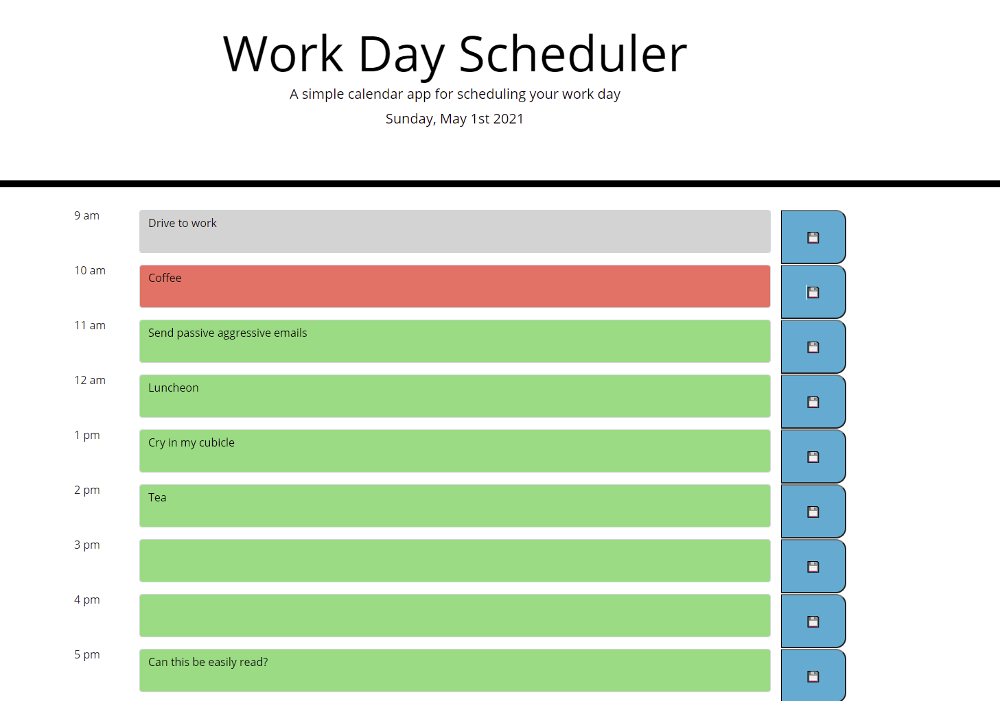

# 5-day_planner
This is the week five homework, the day planner
1.0 Title:
    Day Planner

2.0 Introduction:
    The goal for this week's homework was to create a day planner. The page should contain the date at the top, it should be able to save and repopulate inputs placed into the textareas, and it should change colors as to show highlight the current hour in red, the past hours in grey, and the yet to be hours in green.

3.0 Technologies
    Using Javascript, but utilizing bootstrap for the html index, using moment for the time part, and using jQuery to codense some of the javascript coding.

4.0 Launch
    The website is located at https://speakeasyman.github.io/5-day_planner/
    The repo is located at https://github.com/speakeasyman/5-day_planner

5.0 My Goals:
    The biggest challenge was getting the colors to change. I set an interval, that should check to see if the hour has elapsed every 15 mins from when the page was initally loaded. Also, on hitting a save button, it'll also check the time, and retsart the 15 min interval by reloading the page.

6.0 In Use: 

This is it loaded, not much more to it.  

